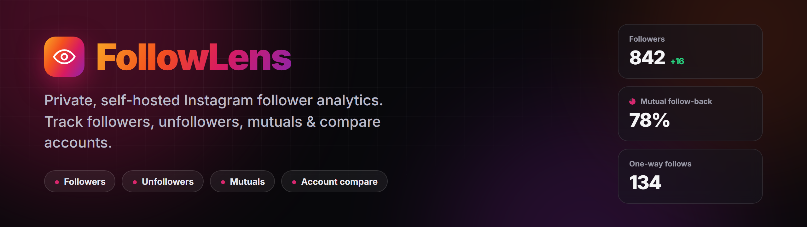
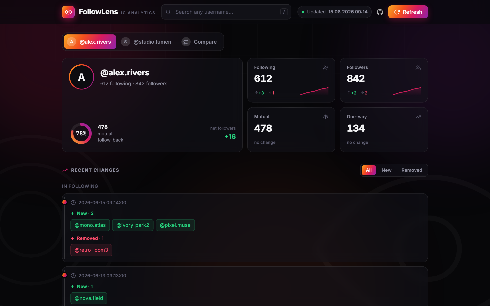
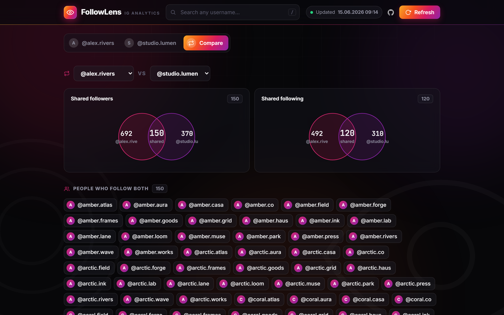
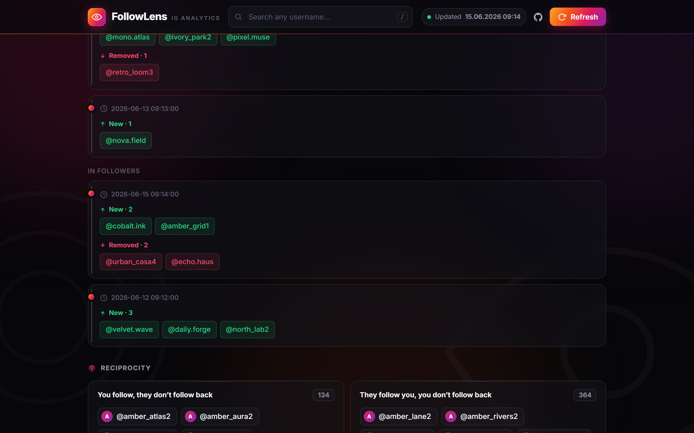

<div align="center">



Track who **followed**, **unfollowed**, **stopped following back**, and **compare accounts** — all on your own machine. No hosted account, no password form.

[](LICENSE)


</div>

---

FollowLens is a self-hosted analytics dashboard for an Instagram account's social graph. It captures timestamped snapshots of your followers and following lists, diffs them between runs, and presents the results — gains, losses, mutuals, one-way connections and cross-account overlap — in a clean local web UI. Authentication uses a browser session cookie, so no password is ever entered, and every byte of data stays in a local folder.



## Features

- **Dashboard** — followers, following, mutuals and one-way follows at a glance, with animated counters and sparkline trends.
- **Change history** — every scan is a timestamped snapshot; new and removed accounts are diffed and grouped by date.
- **Reciprocity** — see who you follow that doesn't follow back, and who follows you that you don't follow back.
- **Account comparison** — Venn-style overlap of shared followers and shared following between any two tracked accounts.
- **Search and filters** — search any username across the active account, and filter the change feed by new or removed.
- **Keyboard shortcuts** — `/` to search, `R` to rescan, `Esc` to clear.
- **Export** — download any account's data as JSON.
- **Private by design** — uses an existing browser session cookie instead of a password, and stores everything locally.

## Screenshots

| Account comparison | Change history |
| --- | --- |
|  |  |

## How it works

1. **Add a session.** Paste your `instagram.com` session cookie into `config.json`. No password is entered at any point.
2. **Run a scan.** FollowLens fetches the follower and following lists for the selected accounts through Instagram's web endpoints.
3. **Review the diff.** Open the dashboard; each run is compared with the previous snapshot to surface exactly what changed.

Instagram does not expose *when* a follow happened, so "recent" always means *since your last scan*. The first scan establishes a baseline; later scans show the changes.

## Installation

```bash
git clone https://github.com/noutrexx/follow-lens.git
cd follow-lens

python -m venv .venv
.venv\Scripts\python.exe -m pip install -r requirements.txt   # Windows
# source .venv/bin/activate && pip install -r requirements.txt  # macOS/Linux

cp config.example.json config.json
```

### Get your session cookie (not your password)

1. Open **instagram.com** in your browser while logged in.
2. Open DevTools (`F12`) → **Application** → **Cookies** → `https://www.instagram.com`.
3. Copy the **value** of the `sessionid` cookie.
4. Paste it into the `sessionid` field of `config.json`.

### Run

```bash
.venv\Scripts\python.exe run.py
```

Open **http://localhost:5005** and click **Refresh**, or trigger a scan directly:

```bash
curl -X POST http://localhost:5005/scan
curl -X POST "http://localhost:5005/scan?force=1"   # skip the cooldown
```

## Configuration

`config.json` is copied from `config.example.json` and is git-ignored.

| Key | Description |
| --- | --- |
| `username` | Your own Instagram username (used for the `self` target). |
| `sessionid` | Your `sessionid` cookie value. Stays local. |
| `targets` | Accounts to track. `"self"` is your account; add any usernames you can access. |
| `known_ids` | Optional `username` → `id` map to skip the rate-limited profile lookup. |
| `delay_seconds`, `delay_jitter_seconds` | Randomized delay between requests. |
| `min_scan_interval_seconds` | Cooldown between full scans (default 600s). |
| `followers_max_passes` | Number of union passes used to collect the followers list. |

## Privacy and safety

- **Local only.** Snapshots and your session cookie live in `config.json` and `data/`, both git-ignored. Nothing is uploaded anywhere.
- **No password.** Authentication uses a session cookie you copy yourself; it never leaves your machine.
- **Conservative scanning.** Randomized delays and a scan cooldown keep request volume low.

> **Disclaimer.** This project is intended for personal and educational use. Automating access to Instagram may violate its Terms of Service and can lead to rate-limiting or account restrictions. You can only read accounts your own session can already access. Use responsibly and at your own risk.

## Tech stack

Python, Flask and requests on the backend; vanilla HTML, CSS and JavaScript on the frontend — no framework and no build step.

## Project structure

```
follow-lens/
├─ run.py                 # entry point: python run.py
├─ backend/               # application code
│  ├─ server.py           #   Flask server (routes and /scan endpoint)
│  ├─ scanner.py          #   scan orchestration: cooldown, diff, snapshots
│  ├─ igweb.py            #   Instagram web client (session-based, rate-limit aware)
│  ├─ storage.py          #   snapshot storage and diff
│  └─ report_html.py      #   dashboard generator
├─ frontend/              # static pages served by the app
│  ├─ landing.html        #   landing page
│  └─ og.svg              #   social preview image
├─ assets/                # images used in this README
├─ config.example.json    # sample config (copy to config.json)
└─ requirements.txt
```

## License

Released under the [MIT License](LICENSE). © noutrexx
