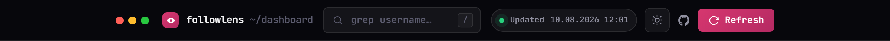

<div align="center">

# FollowLens

**Self-hosted Instagram follower analytics.** Every scan is a snapshot; FollowLens diffs them and tells you exactly who arrived, who left, and who never followed back — on your own machine, without a password.

[](https://github.com/noutrexx/follow-lens/actions/workflows/ci.yml)
[](https://github.com/noutrexx/follow-lens/actions/workflows/codeql.yml)
[](LICENSE)


</div>

---

## Overview

FollowLens captures timestamped snapshots of an account's followers and following lists, compares each run with the one before it, and presents the result as a diff: additions, removals, one-way follows and cross-account overlap.

It runs entirely on your machine. Authentication uses a session cookie you copy from your own browser, so no password is ever typed into the app, and no data is uploaded anywhere.


## Features

| | |
| --- | --- |
| **Scans read as diffs** | Each scan is a pane with a `+N -N` tally and one row per account, signed `+` or `-`, stating what happened: *new follower*, *unfollowed*, *now following*, *stopped following* &mdash; or *account gone* for someone who left both lists at once, which is a deactivated or renamed account rather than an unfollow. |
| **Counters navigate** | Following and followers jump to their lists; mutual and one-way jump to reciprocity. Collapsed lists open on the way. |
| **Change history** | Every run is a timestamped snapshot, so any two runs remain comparable. |
| **Reciprocity** | Accounts you follow that never followed back, and the reverse. |
| **Account comparison** | Shared followers and shared following between any two tracked accounts. |
| **Search and filters** | Match any username in the active account; filter the feed to new or removed. |
| **Themes** | Dark by default. The header toggle switches to light and remembers the choice. |
| **Keyboard** | `/` search · `R` rescan · `T` theme · `Esc` clear. |
| **Accessibility** | Visible focus rings, keyboard-operable counters, and animations that stop when the OS asks for reduced motion. |
| **Export** | Download any account's data as JSON. |

## Screenshots

> Every image below is rendered from a generated demo dataset. No real account appears anywhere in this repository.

### Change history

One pane per scan: window lights, timestamp, tally, then the accounts that moved.


### Reciprocity

Who you follow that never followed back, and the other way round.


### Account comparison

Shared followers and shared following between two tracked accounts.


### Light theme


### Narrow screens


### Landing page


## How it works

1. **Add a session.** Paste your `instagram.com` session cookie into `config.json`. No password is entered at any point.
2. **Run a scan.** FollowLens reads the follower and following lists for the selected accounts through Instagram's web endpoints, spacing requests and honouring a cooldown.
3. **Read the diff.** Each run is compared with the previous snapshot to surface exactly what changed.

Instagram does not expose *when* a follow happened, so "recent" always means *since your last scan*. The first scan establishes a baseline; later scans show movement against it.

## Installation

```bash
git clone https://github.com/noutrexx/follow-lens.git
cd follow-lens
```

```bash
python -m venv .venv
```

```bash
.venv\Scripts\python.exe -m pip install -r requirements.txt
```

On macOS or Linux, activate the environment first with `source .venv/bin/activate`, then `pip install -r requirements.txt`.

```bash
cp config.example.json config.json
```

### Get your session cookie

1. Open **instagram.com** in a browser where you are already signed in.
2. Open DevTools (`F12`) → **Application** → **Cookies** → `https://www.instagram.com`.
3. Copy the **value** of the `sessionid` cookie.
4. Paste it into the `sessionid` field of `config.json`.

The session cookie grants access to your account. Treat it like a password: keep it in `config.json`, which is git-ignored, and never commit or share it.

### Run

```bash
.venv\Scripts\python.exe run.py
```

Open **http://localhost:5005** and click **Refresh**, or trigger a scan directly:

```bash
curl -X POST http://localhost:5005/scan
```

To skip the cooldown:

```bash
curl -X POST "http://localhost:5005/scan?force=1"
```

## Configuration

`config.json` is copied from `config.example.json` and is git-ignored.

| Key | Description |
| --- | --- |
| `username` | Your own Instagram username, used for the `self` target. |
| `sessionid` | Your `sessionid` cookie value. Stays local. |
| `targets` | Accounts to track. `"self"` is your account; add any usernames your session can already see. |
| `known_ids` | Optional `username` → `id` map that skips the rate-limited profile lookup. |
| `delay_seconds`, `delay_jitter_seconds` | Randomised delay between requests. |
| `min_scan_interval_seconds` | Cooldown between full scans. Default 600. |
| `followers_max_passes` | Maximum union passes per friendship list. Both lists stop early once a pass adds nothing new, so a settled list costs one extra pass. Raise it if scans keep reporting the same accounts as leaving and returning. |

## Privacy and safety

- **Local only.** Snapshots and your session cookie live in `data/` and `config.json`, both git-ignored. Nothing is uploaded.
- **No password.** Authentication uses a session cookie you copy yourself.
- **Conservative scanning.** Randomised delays, a scan cooldown and backoff on rate limits keep request volume low.
- **Fails loudly.** If a page of a list cannot be fetched, the scan aborts for that account rather than storing a partial list that would read as a wave of unfollows.

> **Disclaimer.** This project is intended for personal and educational use. Automating access to Instagram may violate its Terms of Service and can lead to rate-limiting or account restrictions. You can only read accounts your own session can already access. Use responsibly and at your own risk.

## Tech stack

Python, Flask and requests on the backend. The frontend is plain HTML and JavaScript styled with Tailwind loaded from a CDN — no bundler, no `node_modules`, no build step. Tests run on `unittest`; CI covers Python 3.10–3.12, linting, CodeQL and secret scanning.

## Project structure

```
follow-lens/
├─ run.py                 # entry point: python run.py
├─ backend/
│  ├─ server.py           #   Flask server: routes and the /scan endpoint
│  ├─ scanner.py          #   scan orchestration: cooldown, diff, snapshots
│  ├─ igweb.py            #   Instagram web client, session-based and rate-limit aware
│  ├─ storage.py          #   snapshot storage and diffing
│  └─ report_html.py      #   dashboard generator
├─ frontend/
│  ├─ landing.html        #   landing page
│  └─ og.svg              #   social preview image
├─ tests/                 # unit tests for diffing, pagination and session parsing
├─ assets/                # images used in this README
├─ config.example.json    # sample config, copy to config.json
└─ requirements.txt
```

## License

Released under the [MIT License](LICENSE). © noutrexx
